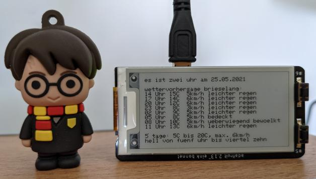

# eInk-Wetterstation
OpenWeatherMap Daten via Raspberry Pi Zero auf ein E-Ink Display

Ziel dieses Bastelprojektes war es, ein kleines Display zu bauen, das immer die aktuelle Zeit in Worten sowie die Wettervorhersage anzeigt. Das ganze sollte zudem ohne Löten oder andere Hardwarebasteleien umsetzbar sein.

# Verwendete Hardware
Für das Projekt wurde folgende Hardware für ungefähr 50€ verwendet:
- [Adafruit 2.13" Monochrome E-Ink Bonnet for Raspberry Pi - THINK INK](https://www.adafruit.com/product/4687) (circa 20€)
- [Raspberry Pi Zero WH](https://www.adafruit.com/product/3708) (circa 15€)
- Micro SD Speicherkarte mit mindestens 16GB (circa 5€)
- [Passendes Micro USB Netzteil](https://www.raspberrypi.org/products/raspberry-pi-universal-power-supply/) (circa 10€)

# Installation
## Vorbereitung Raspberry Pi
- Im [Raspberry Pi Imager](https://www.raspberrypi.org/software/) über "Strg + Umschalt + X" zunächst SSH aktivieren und dann auf der SD-Karte ein Rasperry Pi OS Lite ohne grafische Oberfläche installieren
- Das Display auf den Raspberry aufstecken, SD-Karte einlegen und das ganze mit dem Netzteil an den Strom hängen

## Installation benötigter Software
Jetzt müssen wir noch schnell alles updaten und benötigte Programme installieren:
- Im eigenen Router die IP-Adresse des neuen Gerätes herausfinden
- Via SSH in einem Terminal auf dem Raspberry einloggen `ssh pi@IP-ADRESSE`
- Updates installieren `sudo apt update && sudo apt upgrade`
- `sudo apt-get install python3-pip`
- `sudo pip3 install adafruit-circuitpython-epd`
- `sudo apt-get install ttf-dejavu`
- `sudo apt-get install python3-pil`

Jetzt können wir mit `exit` die Verbindung wieder trennen.

## Anpassen des Python-Scripts
- Die Datei "WetterAppeInk.py" von dieser Seite herunterladen
- Auf [OpenWeatherMap ein neues Konto erstellen](https://home.openweathermap.org/users/sign_up) und dann dort im BenutzerKonto unter "My API Keys" einen neuen kostenlosen Key erstellen
- Mit einem Texteditor die Datei "WetterAppeInk.py" öffnen und ganz oben im Quelltext unter "Rahmendaten" den eigenen API-Key sowie den Namen der gewünschten Stadt angeben.

## Start des Skripts
- Die angepasste Datei "WetterAppeInk.py" sowie die Datei "font5x8.bin" via SSH auf den Raspberry Pi kopieren, z.B. mit `scp /Pfad/zur/Date/WetterAppeInk.py pi@IP-ADRESSE:/home/pi/`
- Via SSh mit dem Raspberry Pi verbinden
- Das Skript mit `nohub python3 WetterAppeInk.py &` starten, mehrmals bestätigen und dann mit `exit` die SSH Verbindung wieder trennen.

## Fertig
Jetzt müsste das Skript automatisch laufen. Falls es nicht funktioniert, einfach nochmal via SSH auf das Gerät schalten und das Skript mit `python3 WetterAppeInk.py` starten. Dann sieht man direkt, welche Fehlermeldung das Gerät ausspuckt.

Das Skript aktualisiert die Anzeige nach knapp drei Minuten. Das kann aber in der letzten Zeile des Quelltextes angepasst werden.

# Sonstiges
- Dieses Script basiert auf den Projekten [Raspberry Pi E-Ink Weather Station using Python](https://learn.adafruit.com/raspberry-pi-e-ink-weather-station-using-python) von [M. LeBlanc-Williams](https://learn.adafruit.com/users/MakerMelissa) sowie [Adafruit 2.13" Monochrome E-Ink Bonnet for Raspberry Pi](https://learn.adafruit.com/2-13-in-e-ink-bonnet) von [Kattni Rembor](https://learn.adafruit.com/users/kattni)
- Alternativ zu dem Start des Scripts via SSH kann dieses natürlich auch einfach in den Autostart integriert werden, so dass dieses nach jedem Neustart automatisch startet
- Die Datei "font5x8.bin" wird zur Darstellung der Schriften benötigt. Ich habe sie von [hier](https://github.com/adafruit/Adafruit_CircuitPython_framebuf/raw/master/examples/font5x8.bin).

Zum Schluss hier noch ein Bild von der Seite, wie das dann am Ende aussehen könnte:

 

Wem das nicht gefällt, der kann sich natürlich ein Gehäuse basteln.

# Freie Software
eInk-Wetterstation ist freie Software. Frei bezieht sich übrigens auf Freiheit, nicht (nur) auf den Preis.

Freie Software garantiert Ihnen die die vier grundlegenden Freiheiten, diese Software zu `verwenden`, zu `verstehen`, zu `verbreiten` und zu `verbessern`.

Mehr Infos zu freier Software finden Sie [hier](https://fsfe.org/freesoftware/freesoftware.de.html).

Sie können dieses Projekt also unter den Bedingungen der von der Free Software Foundation veröffentlichten GNU General Public License (Version 3 der Lizenz) weiter verteilen und/oder modifizieren. 

Dieses Projekt wird in der Hoffnung bereitgestellt, dass es nützlich sein wird, jedoch OHNE JEDE GEWÄHR, sogar ohne die implizite Gewähr der MARKTFÄHIGKEIT oder EIGNUNG FÜR EINEN BESTIMMTEN ZWECK. Siehe die GNU General Public License für weitere Einzelheiten. Eine Kopie der GNU General Public License finden Sie [hier](https://www.gnu.org/licenses/licenses.de.html).
